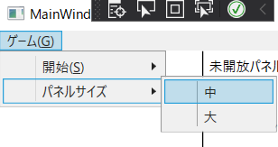
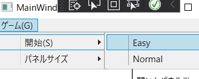
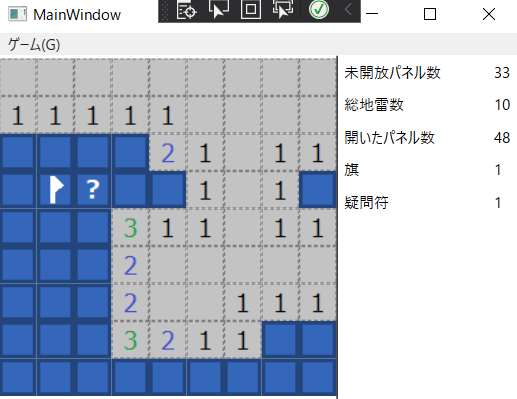
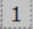

# Description
## 機能
- マインスイーパーです

## 開発の目的
- 開発経験のため

## 目標
- 特にできるだけ見た目のテストを自動化することを目標に設定
  - だいたい達成できた

# Requirement
## ビルドに必要な環境
- Visual Studio
- .NET Framework 4.5

## Nuget 取得Package
- MSTest
  - MSTest.TestAdapter 2.2.3
  - MSTest.TestFramework 2.2.3
- 自動化API
  - Codeer.Friendly 2.6.1
  - Codeer.Friendly.Windows 2.15.0
  - Codeer.Friendly.Windows.Grasp 2.12.0
  - RM.Friendly.WPFStandardControls 1.46.1

# Usage
- メニューバーからパネルサイズを指定
  - 
- ゲーム開始
  - 
  - ゲーム開始後は、再度ゲームを開始するまでパネルサイズを変更できません
- ゲーム画面例
  - 
- パネル説明
  - 
    - 未開放パネル
    - 左クリックで開くことができます
    - 右クリックで旗パネルに変えることができます
  - 
    - 開放済みパネル
    - 隣接する地雷数が表示されます
  - 
    - 旗パネル
    - 左クリックで開くことはできません
    - 右クリックで疑問符パネルに変えることができます
  - 
    - 疑問符パネル
    - 左クリックで開くことはできません
    - 右クリックで未開放パネルに変えることができます

# Install
- 2021/xx/xx時点でコード公開のみ実施しています。お手数ですがご自身でビルドしてください。

# Licence
- [MIT](https://github.com/tcnksm/tool/blob/master/LICENCE)
